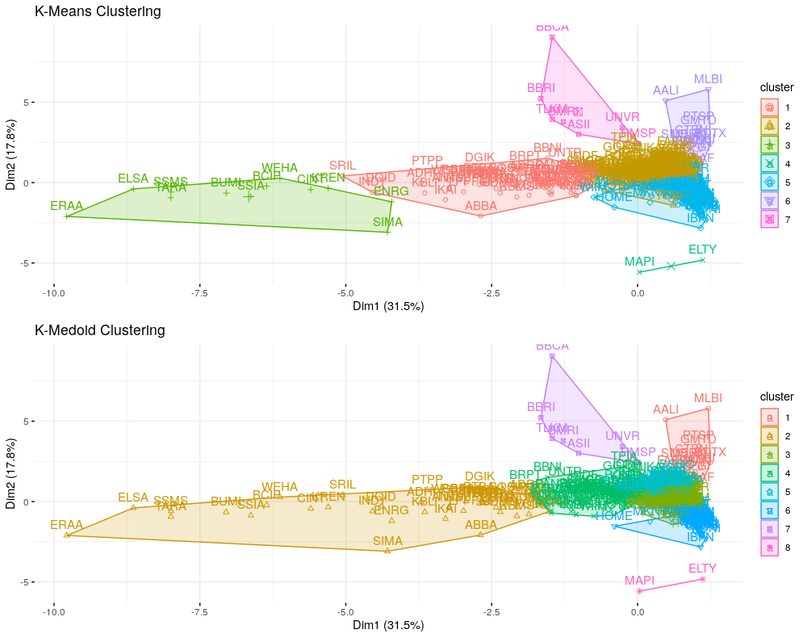
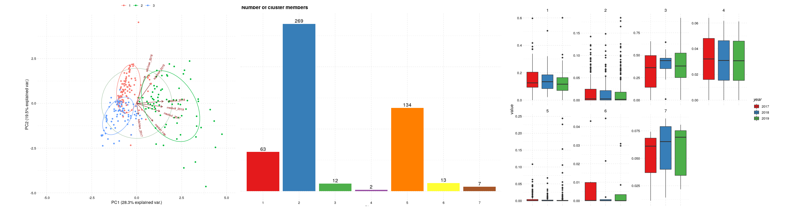

# Unsupervised Learning: Clustering Saham Indonesia

Artikel ini akan membahas clustering pada saham di Indonesia menggunakan algoritma K-Means dan K-Medoid serta melakukan profiling terhadap cluster yang terbentuk. 

## Data

- Profil Perusahaan : didapat dari website resmi idx dengan cara scraping
- Harga Saham : didapat dari Yahoo finance dengan menggunakan package `tidyquant`

## Work Flow
Secara garis besar proses clustering ini memiliki 5 tahapan yaitu : 
- `Data Collaction` : Pengumpulan data dari berbagai sumber.        
- `Feature Engineering` : Mengekstrak feature/ informasi dari data yang ada.     
- `Anomaly Detection` : Mencari data yang bersifat anomali dan menghapusnya sehingga tidak mengganggu cluster yang akan dibentuk.    
- `Clustering` : Mengelompokkan data menjadi beberapa kelompok berdasarkan karakteristik data.    
- `Cluster Profiling` : Mencari karakteristik dari setiap cluster yang sudah terbentuk.     

## Result

Hasil dari clustering adalah profil atau karakteristik dari setiap cluster yang terbentuk.

