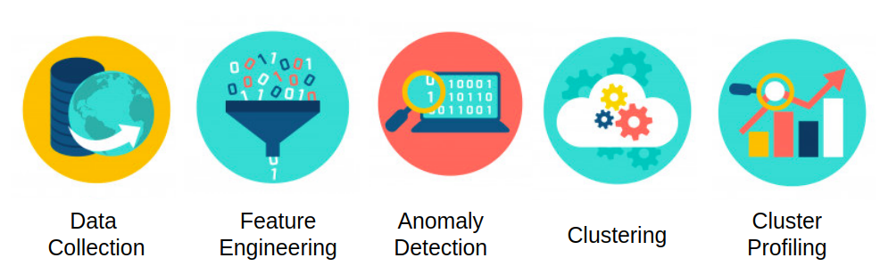

<style>
body {
text-align: justify}
</style>

```{r setup, include=FALSE}
knitr::opts_chunk$set(echo = TRUE, message = F, warning = F, fig.width=12, fig.height=8, cache = TRUE)
options(scipen = 123)
RNGkind(sample.kind = "Rounding")
```

# Pendahuluan

Saham merupkan satuan nilai atau pembukuan dalam berbagai instrumen finansial yang mengacu pada bagian kepemilikan sebuah perusahaan. Perusahaan yang dapat menjual sahamnya ke publik merupakan saham yang sudah listing di bursa atau sudah melakukan Initial Public Offering ([IPO](www.investopedia.com/terms/i/ipo.asp)). Terdapat sekitar 680 saham per Maret 2020 yang sudah listing di bursa efek Indonesia dan jumlahnya terus bertambah seiring berjalannya waktu. Setiap saham yang melantai dibursa memiliki karakteristik yang berbeda beda baik dari sisi fundamental perusahaan maupun pergerakan harga sahamnya dibursa (teknikal), oleh sebab itu perlu dilakukan pengelompokkan emiten berdasarkan karakteristik dari saham itu sendiri.

Clustering merupakan salah satu teknik dari Unsupervised machine learning yang bertujuan mengelompokkan data berdasarkan kemiripan karakteristik antar data. Terdapat banyak pendekatan untuk melakukan clustering seperti partitional methods, density methods, hierarchical methods [dll](en.wikipedia.org/wiki/Cluster_analysis). Setiap metode clustering memiliki kelebihan masing masing seperti metode partitional yang jumlah cluster ditentukan oleh user dan setiap cluster dapat di cari karakteristiksnya karena memiliki pusat cluster.

Artikel ini akan membahas clustering saham menggunakan beberapa algoritma yang berasal dari metode partitional. Setelah melakukan clustering setiap cluster akan dicari karakteristiknya (profiling)

## Setup
Library yang digunakan pada artikel ini terbagi menjadi 3 kategori yaitu wrangling, visualisasi, dan clustering.
```{r}
# wrangling and EDA
library(tidyverse)
library(tidyquant)
library(lubridate)

# Visualization
library(GGally)
library(ggthemes)
library(scales)

#clustering
library(factoextra)
library(FactoMineR)
library(dbscan) # DBSCAN
library(cluster) #K-Medoid
library(kohonen) # SOM
```

## Alur Pengerjaan
Secara garis besar proses clustering ini memiliki 5 tahapan yaitu :    
- `Data Collaction` : Pengumpulan data dari berbagai sumber.        
- `Feature Engineering` : mengekstrak feature/ informasi dari data yang ada.     
- `Anomaly Detection` : Mencari data yang bersifat anomali dan menghapusnya sehingga tidak mengganggu cluster yang akan dibentuk.    
- `Clustering` : Mengelompokkan data menjadi beberapa kelompok berdasarkan karakteristik data.    
- `Cluster Profiling` : Mencari karakteristik dari setiap cluster yang sudah terbentuk.     




# Data Collection

Terdapat 2 sumber data yang digunakan pada analisis ini yaitu data profil perusahaan dan data pergerakan harga saham setiap harinya. Data profil perusahaan didapat dengan cara scraping dari website resmi Bursa Efek Indonesia ([IDX](https://www.idx.co.id/data-pasar/data-saham/daftar-saham/)). Hasil scraping data kemudian di simpan dalam file `daftar_saham.csv`. Emiten yang akan dilakukan clustering adalah emiten yang sudah melantai di bursa sebelum tahun 2017, hal ini bertujuan untuk menghindari [IPO affect](https://budgeting.thenest.com/ipo-affect-stock-value-25189.html). 

```{r message=F}
profile <- read_csv("data_input/daftar_saham.csv") %>% 
  mutate(ListingDate = as.Date(ListingDate)) %>% 
  filter(year(ListingDate) < 2017)
head(profile)
```

Terdapat 6 variabel dari data profil perusahaan yaitu :    
- `Code` : Kode Emiten perusahaan di bursa    
- `Name` : Nama Perusahaan    
- `ListingDate` : Tanggal Perusahaan pertama kali melantai dibursa    
- `Share` : banyaknya lembar sahan suatu perusahaan    
- `ListingBoard` : papan pencatatan saham (Pengembangan dan Utama)    
- `Sector` : kategori perusahaan berdasarkan sektornya [9 sektor saham](https://investorsadar.com/sektor/)    

Data pergerakan harga saham didapat dari yahoo finance yang bisa langsung diakes menggunakan function `tq_get()` dari packages `tidyquant`. Kode emiten saham Indonesia pada yahoo finance diakhiri oleh `.JK` sebagai tanda bahwa emiten tersebut berasal dari Indonesia.

```{r}
emiten_code <- profile %>% 
  mutate(Code = paste0(Code,".JK")) %>% 
  pull(Code) %>% 
  as.character()
emiten_code[1:5]
```

Setelah kode emiten sudah didapat tahap selanjutnya mengambil data pergerakan harga saham setiap harinya mulai dari awal tahun 2017 hingga akhir tahun 2019 menggunakan function `tq_get()`. Terdapat beberapa parameter yang harus di isi pada function `tq_get()` yaitu : 

- `x` : Kode emiten    
- `from` : tanggal dimulai harga saham diambil    
- `to` : tanggal berakhir harga saham diambil    

Data yang sudah diambil kemudian di simpan dalam file `stocks.csv` dan menghilangkan `.JK` pada kode emiten
```{r}
# stocks <- tq_get(emiten_code, from = "2017-01-01", to = "2019-12-31")
stocks <- readr::read_csv("data_input/stocks.csv") %>% 
  mutate(symbol = str_remove_all(symbol, ".JK"))
head(stocks)
```

Pada data stocks terdapat 8 variabel yaitu :    
- `symbol` : Kode Emiten perusahaan di bursa    
- `date` : Tanggal dari harga saham    
- `open` : Harga pembukaan    
- `high` : Harga tertinggi    
- `low` : Harga terendah     
- `close` : Harga penutupan     
- `volume` : banyaknya lembar saham yang diperdagangkan    
- `adjusted` : harga penutupan yang sudah disesuikan dengan aksi korporasi lainnya. [adj close](https://www.investopedia.com/terms/a/adjusted_closing_price.asp)    

Terdapat beberapa kode saham yang tidak dapat diambil data pergerakan harganya, hal ini disebabkan tidak adanya kode emiten pada yahoo finance. berikut adalah kode emiten tersebut
```{r}
done <- stocks %>% 
  pull(symbol) %>% 
  unique()

profile %>% 
  filter(!Code %in% done) %>% 
  pull(Code)
```


# Feature Engineering {.tabset .tabset-fade .tabset-pills}
Feature engineering merupakan suatu proses yang menggunakan expert domain knowledge untuk mengekstrak informasi yang ada pada data dengan tujuan meng-improve hasil dari machine learning. Terdapat 3 feature yang akan diekstrak dari data yang ada yaitu volatilitas (Volatility), liquiditas (Liquidity) serta kapasitas (size) dari suatu saham. 

## Volatilitas (Volatility)

```{r fig.width=12, fig.height=4, echo=F}
stocks %>% 
  filter(year(date) == 2017, 
         symbol == "AALI") %>% 
  ggplot(aes(x = date)) +
  geom_candlestick(aes(open = open, high = high, low = low, close = close), 
                   fill_up = "green") +
  theme_pander() +
  labs(title = "Stocks with High Volatility", 
       subtitle = "AALI 2017 Price")
```

Volatilitas merupakan indikator tingkat perubahan harga saham setiap harinya. Volatilitas suatu saham bisa dilihat dari persentase perubahan harga saham setiap harinya, apabila suatu saham dapat naik dan turun dengan persentase yang besar maka saham tersebut bisa dikatakan memiliki volatilitas yang tinggi begitu juga sebaliknya. Nilai yang bisa digunakan untuk mengukur tingkat volatilitas suatu saham yaitu standar deviasi dari persentase perubahan harga. Perhitungan standar deviasi dilakukan pada persentase perubahan harga disetiap tahunnya. Semakin besar nilai standar deviasi maka perubahan harga saham dapat berubah dengan cepat setiap harinya. 

```{r}
stocks %>% 
  na.omit() %>% 
  mutate(change = (close- lag(close))/lag(close)) %>%
  group_by(symbol, year(date)) %>% 
  summarise(sdclose = StdDev(change)) %>% 
  ungroup() %>% 
  head(6)
```

## Likuiditas (Liquidity)

```{r fig.width=12, fig.height=4, echo=F}
p1 <- stocks %>% 
  filter(year(date) == 2019, symbol == "POOL") %>% 
  ggplot(aes(x = date)) +
  geom_candlestick(aes(open = open, high = high, low = low, close = close), 
                   fill_up = "green") +
  theme_pander() +
  theme(axis.text.x = element_blank(), 
        axis.title.x = element_blank()) +
  labs(y = "Price", 
       title = "Stocks with High Liquidity", 
       subtitle = "POOL Price and Volume 2019")

p2 <- stocks %>% 
  filter(year(date) == 2019, symbol == "POOL") %>%
  mutate(col = ifelse(close > lag(close), "up","down")) %>% 
  na.omit() %>% 
  ggplot(aes(x = date, y = volume, fill = col)) +
  geom_col() + 
  theme_pander() +
  scale_fill_manual(values = c("red","green")) +
  theme(legend.position = "none") +
  scale_y_continuous(labels = scales::unit_format(unit = 'M', scale = 1e-6))

ggpubr::ggarrange(p1,p2, ncol = 1)
```


Likuiditas merupakan indikator seberapa mudah saham tersebut untuk dijual dan dibeli tanpa mempengaruhi harga aset. Likuiditas suatu saham dapat dilihat dari volume saham itu. Semakin besar volume dari suatu saham yang diperdagangkan setiap harinya maka semakin liquid saham tersebut. Median dari volume saham akan digunakan sebagai indikator likuiditas suatu saham. Median dipilih karena tidak sensitif terhadap oulier dibandingkan rata rata (mean).

Bila dimelihat dari segi volume saja maka dapat terjadi bias, karena setiap emitan memiliki total volume yang berbeda beda oleh sebab itu volume suatu saham akan dibagi terlebih dahulu dengan jumlah lembar saham (total share) setiap emiten. Total share didapat dari data `profile` sehingga perlu dilakukan penggabungan 2 data frame (join) terlebih dahulu.

```{r}
liq_stocks <- stocks %>% 
  na.omit() %>% 
  left_join(profile, by = c("symbol" = "Code")) %>% 
  mutate(volume = volume / Shares) %>% 
  group_by(symbol, year(date)) %>% 
  summarise(med_vol = median(volume)) %>% 
  ungroup() %>% 
  arrange(desc(med_vol)) %>% 
  slice(1:3,508:510) %>% 
  pull(symbol)


stocks %>% 
  na.omit() %>% 
  left_join(profile, by = c("symbol" = "Code")) %>% 
  mutate(volume = volume / Shares) %>% 
  filter(symbol %in% liq_stocks) %>%
  mutate(med = ifelse(symbol %in% liq_stocks[1:3], "high", "low")) %>% 
  ggplot(aes(volume)) +
  geom_histogram(aes(fill = med)) +
  facet_wrap(~symbol, scales = "free") +
  theme_pander() +
  scale_fill_manual(values = c("firebrick3", "dodgerblue4"))
  
```

Plot histogram diatas menunjukkan 2 jenis saham berdasarkan likuiditasnya. Plot dengan warna merah merupakan saham paling likuid berdasarkan mediannya, sedangkan plot yang berwarna biru merupakan saham tidak liquid berdasarkan mediannya

## Size
size merupakan ukuran seberapa besar perusahaan berdasarkan harga sahamnya. Nilai size bisa diwakili oleh market capitalization (market cap), market cap merupakan perkalian antar total share dengan harga saham tersebut. Semakin besar market cap maka semakin sulit untuk harga saham dipermainkan oleh segelintir orang. pada data ini market cap yang akan digunakan mengacu pada harga penutupan akhir tahun 2019
```{r}
market_cap <- stocks %>% 
  group_by(symbol) %>% 
  slice(n()) %>% 
  ungroup() %>% 
  left_join(profile, by = c("symbol" = "Code")) %>% 
  mutate(market_cap = close *Shares) %>% 
  select(symbol, market_cap) %>% 
  arrange(desc(market_cap))

market_cap %>% 
  slice(-1) %>%
  head(10) %>% 
  left_join(profile, by = c("symbol" = "Code")) %>% 
  ggplot(aes(x = reorder(symbol, market_cap), y = market_cap)) +
  geom_col(aes(fill = sector)) +
  coord_flip() +
  labs(title = "Top 10 Market Capitalization", 
       subtitle = "30-12-2019", 
       x = "Emiten", 
       y = "Market Capitalization on IDR") +
  scale_y_continuous(labels = scales::comma)+
  theme_pander()

```


## Create Data frame
Setelah mengetahui variabel apa saja yang akan digunakan dalam proses clustering, tahap selanjutnya adalah menggabungkan semua variabel tersebut menjadi 1 dataframe. 
```{r}
stocks_agg <- stocks %>% 
  na.omit() %>% 
  mutate(change = (close- lag(close))/lag(close)) %>% 
  group_by(symbol, year(date)) %>% 
  summarise(sdclose = StdDev(change), # volatility
            medvol = round(median(volume)) # liquidity
            ) %>% 
  ungroup() %>% 
  left_join(select(profile, Code, Shares) , by = c("symbol"="Code")) %>% 
  mutate(medvol = medvol/Shares*100) %>% 
  select(-Shares) %>% 
  rename(year = 2)
head(stocks_agg)
```

Dari hasil aggregasi data diatas didapat 4 variabel yaitu `symbol`, `year`, `sdclose`, `medvol`. `sdclose` merupakan standar deviasi dari close price, dan `medvol` merupakan median dari volume saham yang sudah dibagi dengan total share dari masing masing emiten. Agar data tersebut dapat digunakan pada proses clustering maka satu baris harus mewakili 1 saham sehingga perlu dilakukan transformasi data menjadi *wide format data frame* serta menambahakan data market cap.

```{r}
data_final <-  stocks_agg %>% 
  rename(year = 2) %>% 
  pivot_wider(names_from = year, values_from = c(3:4)) %>% 
  left_join(market_cap) %>% 
  select(symbol, market_cap, everything()) %>% 
  replace(is.na(.),0) %>% 
  column_to_rownames(var = "symbol")
data_final
```

Data untuk proses clustering sudah siap, `data_final` terdiri dari 510 baris yang setiap barisnya mewakili 1 emiten. variabel yang digunakan dalam proses clustering terdapat 7 variabel yaitu market_cap, standar deviasi, dan median dari tahun 2017 hingga 2019. 


# Outlier Detection
Outlier/anomaly detection merupakan teknik mencari data yang bersifat berbeda eksteam dari data lainnya. Pendeteksian outlier perlu dilakukan mengingat algoritma k-means merupakan algoritma yang tidak robust terhadap outlier. Pendeteksian outlier menggunakan algoritma DBSCAN yang merupakan salah satu algoritma clustering berdasarkan kerapatan antar data (density method).  

Berbeda dengan algoritma K-Means yang harus menentukan jumlah cluster diawal, metode BDSCAN memerlukan minimum points (minPts) dan epsilon (eps) untuk proses pembuatan clusternya. Pencarian nilai Eps dan MinPts yang optimal bisa dilakukan dengan metode `knee plot`. Pembuatan knee plot dapat menggunakan fungsi `kNNdistplot` dari packages `dbscan`. Ide utama dari fungsi ini adalah menghitung jarak rata2 untuk setiap data ke k tetangga terdekatnya (nearest neighbors). Nilai dari K ditentukan oleh user yang nantinya akan digunakan sebagai minPts pada proses clustering. Rata rata jarak yang sudah didapat divisualisasikan dalam plot secara ascending untuk mendapatkan “knee” yang menunjukkan nilai optimal dari eps berdasarkan K yang ditentukan.

```{r}
kNNdistplot(scale(data_final), k = 8)
abline(h = 2.5, col = "red")
```

Berdasarkan plot diatas dengan menggunakan K = 8 didapat jarak yang optimal yaitu sekitar 0.25. Nilai 0.25 didapat dari posisi “knee” yang terbentuk pada plot. Hasil pencarian nilai eps yang optimal diatas dapat digunakan dalam proses clustering yang mana nilai eps adalah 0.25 dengan minPts 8. Tahap selanjutnya adalah pembuatan cluster menggunakan function `dbscan` dengan parameter yang sudah didapat.

```{r}
# DBSCAN clustering
dbscan_clust <- dbscan(scale(data_final), eps = 2.5, minPts = 8)
dbscan_clust
```

Dari hasil clustering menggunakan metode DBSCAN didapat 10 data noise atau outlier. untuk mengetahui 10 saham yang termasuk outlier perlu dilakukan labeling cluster terhadap data yang digunakan.
```{r}
# cluster yang outlier
stocks_anomaly <- data_final %>% 
  rownames_to_column(var = "symbol") %>% 
  mutate(temp_clust = dbscan_clust$cluster) %>% 
  filter(temp_clust==0) %>% 
  pull(symbol)
stocks_anomaly
```

ke-10 saham yang sudah didapat perlu dilihat seberapa ekstream perbedaanya dengan data yang lain oleh sebab itu kita perlu melihatnya menggunakan biplot. Biplot merupakan teknik visualisasi dari hasil Principal Component Analysis (PCA). PCA merupakan teknik mereduksi dimensi dengan mempertahankan informasi sebanyak mungkin. Fungsi yang digunakan dalam pembuatan PC adalah `PCA()`,  dan untuk untuk membuat biplot menggunakan `plot.PCA()` dari package `FactoMineR`. 

```{r fig.height=8}
 data_final %>% 
  rownames_to_column(var = "symbol") %>% 
  mutate(temp_clust = as.factor(dbscan_clust$cluster)) %>% 
  column_to_rownames("symbol") %>% 
  PCA(graph = F, quali.sup = 8) %>% 
  plot.PCA(choix = "ind", 
           select = "contrib10",
           habillage = 8,
           col.hab = c("red", "black"))
```

Berdasarkan hasil visualisasi biplot dapat dilihat emiten yang berwarna merah lokasinya cukup jauh dari kumpulan data yang ada, terutama emiten BCIC. 
Data yang diindikasikan outlier tidak akan digunakan dalam proses clustering karena dapat mengganggu proses pembuatan cluster.
```{r}
data_final_scale <- data_final %>% 
  rownames_to_column(var = "symbol") %>% 
  mutate(temp_clust = dbscan_clust$cluster) %>% 
  filter(temp_clust!=0) %>% 
  column_to_rownames(var = "symbol") %>% 
  select(-temp_clust) %>% 
  scale()
tail(data_final_scale)
```

Data yang akan digunakan dalam proses clustering juga harus dilakukan scaling, hal ini dikarenakan metode K-Means berdasarkan perhitungan jarak antar data (euclidian distance) yang mana range antar data harus sama. proses scaling yang dilakukan menggunakan metode z-score, proses scaling hanya merubah skala dari data tanpa merubah distribusi data awal.

# Clustering {.tabset .tabset-fade .tabset-pills}

##  K-Means

K-Means merupakan algoritma clustering yang masuk kedalam kategori *partitioning clustering* yang berarti jumlah cluster ditentukan oleh user. Algoritma K-Means menghasilkan pusat cluster yang disebut centroid. Centroid dari setiap cluster bukanlah sebuah data melainkan sebuah titik yang merepresentasikan rata-rata (mean) nilai dari setiap variabel di setiap cluster. Penentuan nilai K yang optimum dapat menggunakan teknik elbow method. Elbow method mengoptimalkan jarak antar data ke centroid atau sering disebut within sum of square(wss). Nilai K yang optimum adalah ketika jumlah cluster ditambah namun penurunan wss tidak lagi drastis.

```{r fig.height=8}
kmeansTunning <- function(data, maxK) {
  withinall <- NULL
  total_k <- NULL
  for (i in 2:maxK) {
    set.seed(122)
    temp <- kmeans(data,i)$tot.withinss
    withinall <- append(withinall, temp)
    total_k <- append(total_k,i)
  }
  plot(x = total_k, y = withinall, type = "o", xlab = "Number of Cluster", ylab = "Total wss")
  abline(h = 1080, col  = "firebrick3", lty = 2)
}
kmeansTunning(data_final_scale, maxK = 10)
```

Berdasarkan elbow plot diatas dapat dilihat ketika jumlah cluster ditambah dari 7 ke 8 penurunan nilai total withinss sudah tidak pesat lagi, sehingga jumlah cluster yang diambil adalah 7.   

```{r fig.height=8}
set.seed(122)
clust <- kmeans(data_final_scale,7)
fviz_cluster(clust, data_final_scale, ggtheme = theme_minimal()) 
```

Jumlah data disetiap cluster berbeda beda. Cluster 4 merupakan cluster dengan anggota terkecil yaitu 2 data, sedangkan cluster 2 merupakan cluster terpadat dengan jumlah anggota sebesar 269 dan total wss sebesar 272. 

```{r}
kmeans_total <- clust$cluster %>% 
  table() %>% 
  as.numeric()

data.frame(cluster = c(1:7), 
           member = kmeans_total, 
           wss = clust$withinss) %>% 
  arrange(wss)
```

salah satu nilai yang bisa digunakan untuk mengetahui seberapa baik cluster yang dihasilkan oleh algoritma K-Means adalah perbandingan antara nilai  between_SS dengan total_SS. hasil pembagian antara `between_SS` dengan `total_SS` mengindikasikan seberapa berkumpul data di setiap centroidnya.   hasil yang didapat dari perbandingan kedua nilai tersebut adalah 69.1 % yang mana apabila semakin mendekati 100% semakin baik.

```{r}
clust$betweenss / clust$totss *100
```

##  K-Medoid

Sama seperti K-Means, K-Medoid merupakan algoritma clustering yang masuk kedalam kategori *partitioning clustering*. Berbeda dengan K-Means pada K-medoid pusat clusternya merupakan salah satu data yang ada didalam cluster sehingga pusat cluster disebut **medoid**. 
Penentuan nilai K yang optimum bisa digunakan teknik elbow method. Elbow method mengoptimalkan jarak antar data ke centroid atau sering disebut within sum of square. Nilai K yang optimum adalah ketika jumlah cluster ditambah namun penurunan wss tidak lagi drastis.


```{r}
# Elbow method
fviz_nbclust(data_final_scale, pam, method = "wss") +
    geom_vline(xintercept = 8, linetype = 2)+
  geom_hline(yintercept = 1100)+
  labs(subtitle = "Elbow method")

```


```{r}
kmedoid <- pam(x = data_final_scale, k = 8)
fviz_cluster(kmedoid, data_final_scale, ggtheme = theme_minimal())
```


```{r}
kmedoid <- pam(x = data_final_scale, k = 8)

kmedoid$clusinfo %>% 
  as.data.frame() %>% 
  mutate(avg_sil = kmedoid$clus.avg.widths, 
         medoid = rownames(kmedoid$medoids))
```

size : jumlah anggota cluster
max_diss : nilai perbedaan paling maksimum antara data terhadap medoid (data yang menjadi pusat cluster)
av_diss : rata rata nilai perbedaan antar data terhadap medoid
diameter : perbedaan terbesar antar 2 data dalam 1 cluster
separator : perbedaan paling kecil antar data dalam cluster terhadap data yang berada di cluster lain
avg_sil : rata2 silhouette value
medoid : data yang menjadi pusat cluster

## K-Means + SOM

create som grid
```{r}
# make grid
set.seed(122)
ads.grid <- somgrid(xdim = 4, ydim = 5, topo = "rectangular")
```

create som 
```{r}
# make a SOM model
set.seed(122)
ads.model <- som(data_final_scale,
                 ads.grid,
                 rlen = 500, 
                 keep.data = TRUE,
                 dist.fcts = "euclidean")

plot(ads.model, type = "mapping", pchs = 19, shape = "round")
```


create som based on som result
```{r}
kmeansTunning(ads.model$codes[[1]], maxK = 10) 
set.seed(122)
som_kmeans <- kmeans(ads.model$codes[[1]], 6)
```


```{r}
data_final_scale %>% 
  as.data.frame() %>% 
  mutate(som_grid = ads.model$unit.classif, 
          cluster = som_kmeans$cluster[ads.model$unit.classif]) %>% 
  select(cluster,som_grid) %>% 
  table() %>% 
  as.data.frame() %>% 
  ggplot(aes(x = som_grid, y = cluster)) +
  geom_raster(aes(fill = Freq))+
  geom_text(aes(label = Freq), col = "white") +
  scale_fill_gradient(low = "grey",
  high = "red") +
  labs(x = "SOM Grid", 
       y = "K-Means Cluster") +
  theme_minimal() +
  theme(legend.position = "none", 
        axis.text = element_text(size = 12), 
        panel.grid = element_blank()) 
```

```{r}
plot(ads.model, type = "codes", bgcol = rainbow(6)[som_kmeans$cluster], main = "Cluster Map")
add.cluster.boundaries(ads.model, clust$cluster)
```


```{r fig.width=4, fig.height=6}
df <- data.frame(x = c(rep(1:4, 5)), 
                 y = c(rep(1, 4), rep(2, 4), rep(3, 4), rep(4, 4), rep(5,4)),
                 color = runif(20, 0, 100),
                 cluster = som_kmeans$cluster)
df %>% 
  ggplot(aes(x,y))+
  geom_tile(aes(fill = as.factor(cluster) ), color = "black") +
  geom_text(aes(label = paste0("Grid:", 1:20)), nudge_y = 0.05) +
  geom_text(aes(label = paste0("Cluster:", cluster)), nudge_y = -0.15) +
  scale_x_continuous(limits = c(0.5,4.5)) +
  theme_minimal() +
  theme(panel.grid = element_blank(),
        axis.text = element_blank(), 
        axis.title = element_blank(), 
        legend.position = "none") +
  scale_fill_manual(values = rainbow(6))
```

# Cluster Profiling

### K-Means and K-Medoid


hasil cluster antara k-medoid dan K-means tidak tidak terlalu jauh berbeda. K-Means dengan jumlah cluster sebanyak 7 cluster memperoleh wss sebesar 1080 sedangkan k_medoid dengan jumlah cluster 8 mendapatkan wss sebesar 1100.  Bila hasil hasil cluster antar 2 metode tersebut dibandingkan secara langsung maka menghasilkan visualisi seperti dibawah
```{r}
data_final_scale %>% 
  as.data.frame() %>% 
  transmute(clust_means = clust$cluster, 
         clust_medoid = kmedoid$clustering) %>% 
  table() %>% 
  as.data.frame() %>% 
  ggplot(aes(x = clust_means, y = clust_medoid)) +
  geom_raster(aes(fill = Freq))+
  geom_text(aes(label = Freq), col = "white") +
  scale_fill_gradient(low = "grey",
  high = "red") +
  labs(x = "K-Means Cluster", 
       y = "K-Medoid Cluster") +
  theme_minimal() +
  theme(legend.position = "none", 
        axis.text = element_text(size = 12), 
        panel.grid = element_blank())
```


dari hasil visualisasi diatas bisa dilihat bahwa cluster 7 pada K-means memiliki anggota yang sama dengan cluster 7 pada K-medoid. Sedangkan cluster 2 pada K-means terpecah ke cluster 1, 3, 4, dan 5 pada k-medoid hal ini disebabkan karena jarak antar data yang sangat berdekatan seperti plot dibawah

```{r}
ggpubr::ggarrange(
  fviz_cluster(clust, data_final_scale, main = "K-Means Clustering", ggtheme = theme_minimal()),
  fviz_cluster(kmedoid, data_final_scale, main = "K-Medoid Clustering",  ggtheme = theme_minimal()), 
  ncol = 1  
  )

```


```{r fig.height=12}
type_v <- c("cap" = "Market Capitalization",
        "medvol" = "Median of Volume Ratio",
        "sdclose"="Standard Deviation")
cluster_method <- c("clust_means" = "K-Means Algorithm",
        "clust_medoid"= "K-Medoid Algorithm")


data_viz <- data_final %>% 
  rownames_to_column(var = "symbol") %>% 
  mutate(temp_clust = dbscan_clust$cluster) %>% 
  filter(temp_clust!=0) %>% 
  mutate(clust_means = clust$cluster, 
         clust_medoid = kmedoid$clustering) %>% 
  select(symbol,clust_means,clust_medoid, everything(), -temp_clust) %>% 
  rename(cap_2019 = market_cap) %>% 
  pivot_longer(cols = -(1:3), names_to = c("kind","year"), 
               names_pattern = "(.*)_(.*)") %>% 
  pivot_longer(cols = 2:3, names_to = "method", values_to = "cluster")

 data_viz%>% 
  ggplot(aes(x= cluster, y = value)) +
  geom_col(aes(fill = year), position = "dodge") +
  facet_grid(kind~method, 
             scales = "free",
             labeller = labeller(kind = type_v, 
                                 method = cluster_method)) +
  labs(y = NULL, 
       x = "Cluster") +
  theme_minimal() +
  theme(legend.position = "none",
        text = element_text(size = 15))
  
```


### K-Means + SOM


# Kesimpulan


**cluster from which method that would you use?**


```{r}
data_final %>% 
  rownames_to_column(var = "symbol") %>% 
  mutate(temp_clust = dbscan_clust$cluster) %>% 
  filter(temp_clust!=0) %>% 
  mutate(clust_means = clust$cluster, 
         clust_medoid = kmedoid$clustering) %>% 
  select(symbol,clust_means,clust_medoid, everything(), -temp_clust) %>% 
  group_by(clust_means) %>% 
  summarise_all(mean) %>% 
  select(-c(2:3))
```


```{r}
data_final %>% 
  rownames_to_column(var = "symbol") %>% 
  mutate(temp_clust = dbscan_clust$cluster) %>% 
  filter(temp_clust!=0) %>% 
  mutate(clust_means = clust$cluster, 
         clust_medoid = kmedoid$clustering) %>% 
  select(symbol,clust_means,clust_medoid, everything(), -temp_clust) %>% 
  group_by(clust_medoid) %>% 
  summarise_all(mean) %>% 
  select(-c(2:3))
```

```{r fig.height=12}
type_v <- c("cap" = "Market Capitalization",
        "medvol" = "Median of Volume Ratio",
        "sdclose"="Standard Deviation")
cluster_method <- c("clust_means" = "K-Means Algorithm",
        "clust_medoid"= "K-Medoid Algorithm", 
        "clust_som" = "K-Means Using SOM")


data_viz <- data_final %>% 
  rownames_to_column(var = "symbol") %>% 
  mutate(temp_clust = dbscan_clust$cluster) %>% 
  filter(temp_clust!=0) %>% 
  mutate(clust_means = clust$cluster, 
         clust_medoid = kmedoid$clustering, 
         clust_som = som_kmeans$cluster[ads.model$unit.classif]) %>% 
  select(symbol,clust_means,clust_medoid,clust_som, everything(), -temp_clust) %>% 
  rename(cap_2019 = market_cap) %>% 
  pivot_longer(cols = -(1:4), names_to = c("kind","year"), 
               names_pattern = "(.*)_(.*)") %>% 
  pivot_longer(cols = 2:4, names_to = "method", values_to = "cluster")

 data_viz%>% 
  ggplot(aes(x= cluster, y = value)) +
  geom_col(aes(fill = year), position = "dodge") +
  facet_grid(kind~method, 
             scales = "free",
             labeller = labeller(kind = type_v, 
                                 method = cluster_method)) +
  labs(y = NULL, 
       x = "Cluster") +
  theme_minimal() +
  theme(legend.position = "none",
        text = element_text(size = 15))
  
```


cluster dengan market cap terbesar ?
cluter paling likuid / tidak ?
cluster paling volatilitas ?


bedah setiap cluster


# Kesimpulan

berapa cluster optimum?
metode apa yang digunakan?
bagaimana profil cluster secara general


# Glossary


## Stock Terms
- Emiten 

- IPO

## Machine Learning Term


- centroid

- medoid

- Unsupervised Learning

- withinss

- shilouette

- knee

- elbow

-between_ss

_total_ss

# Reference
For feature selection 
https://www.investopedia.com/terms/f/factor-investing.asp

SOM algorithm
https://algotech.netlify.com/blog/self-organizing-maps/

https://subscription.packtpub.com/book/big_data_and_business_intelligence/9781789956399/1/ch01lvl1sec08/introduction-to-k-medoids-clustering
 

https://www.idx.co.id/data-pasar/data-saham/daftar-saham/

[volatility](https://www.investopedia.com/terms/v/volatility.asp). 

https://www.datanovia.com/en/lessons/determining-the-optimal-number-of-clusters-3-must-know-methods/